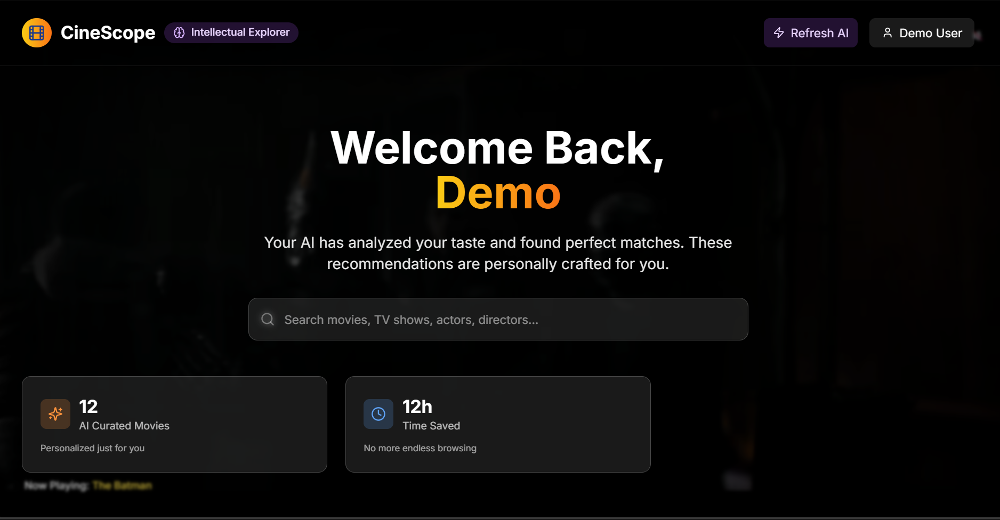
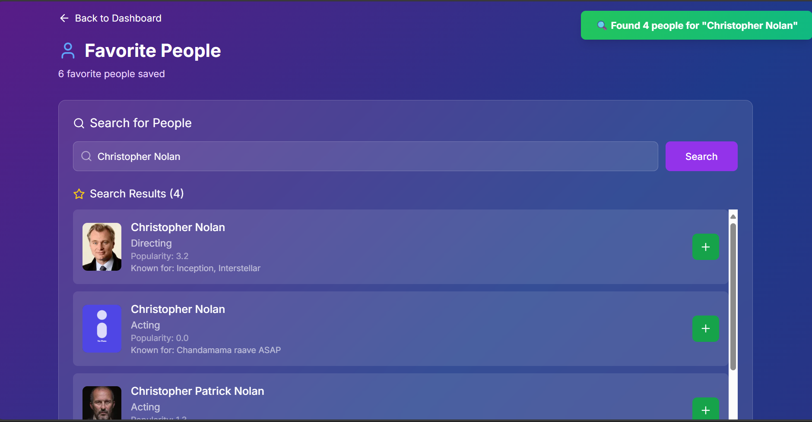
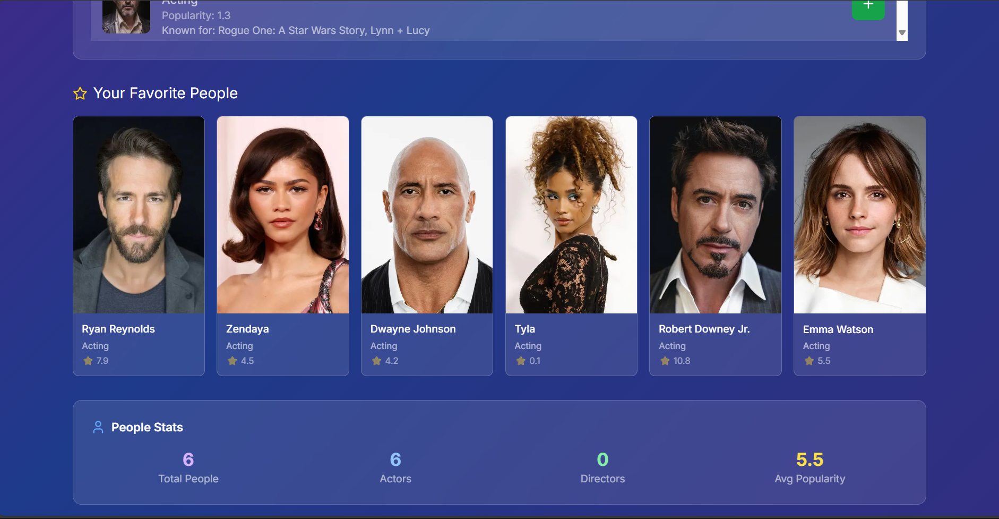
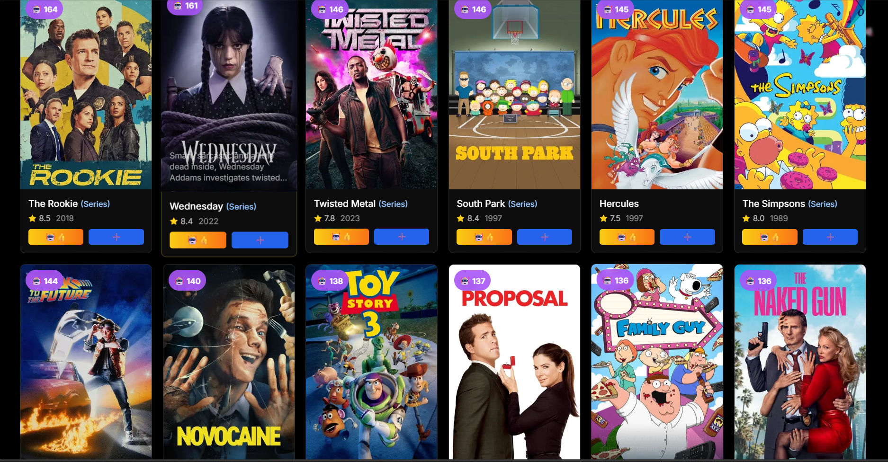

# 🎬 CineScope

**Your AI-Powered Movie Companion**

Never wonder what to watch again. CineScope uses advanced AI to understand your unique taste and delivers movie recommendations so perfect, you'll feel like we're reading your mind.


## Screenshots

### Home Page



### Search Page



### Movie Page



### Profile Page



## ✨ Features

### 🧠 AI Personality Analysis
- Deep psychological profiling from your movie preferences
- Understands what you really love, not just what you rate highly
- Adapts to your mood and viewing context

### 🎯 Context-Aware Recommendations
- Different suggestions for date night vs solo viewing
- Time-based recommendations (morning energy vs late-night atmosphere)
- Mood-sensitive picks based on your current state

### ⏰ Smart Timing Notifications
- Learns your optimal viewing times
- Sends personalized recommendations at perfect moments
- Respects your schedule and preferences

### 👥 Social Discovery
- Import your IMDB watchlist seamlessly
- Find users with similar taste
- Safe, moderated community reviews
- Friend recommendations based on compatibility scores

### 🛡️ Safety & Privacy First
- Content moderation and spoiler protection
- Rate limiting and spam prevention
- Privacy-focused design with optional social features

## 🚀 Tech Stack

**Frontend**
- Next.js 14 - React framework with App Router
- TypeScript - Type safety and better developer experience
- Tailwind CSS - Utility-first styling
- Framer Motion - Smooth animations and interactions

**Backend**
- Next.js API Routes - Serverless functions
- Prisma - Type-safe database ORM
- PostgreSQL - Robust relational database
- NextAuth.js - Authentication and session management

**AI & Data**
- TMDB API - Movie data and posters
- OpenAI API - Personality analysis and recommendations
- Custom ML Models - Collaborative filtering and taste matching

## 🛠️ Getting Started

### Prerequisites
- Node.js 18+
- PostgreSQL database
- TMDB API key

### Installation

**Clone the repository**
```bash
git clone https://github.com/teddexter0/cineScope.git
cd cinescope
```

**Install dependencies**
```bash
npm install
```

**Set up environment variables**
```bash
cp .env.example .env.local
```

Fill in your `.env.local`:
```env
DATABASE_URL="your-database-url"
NEXTAUTH_SECRET="your-secret-key"
TMDB_API_KEY="your-tmdb-api-key"
```

**Set up the database**
```bash
npx prisma db push
npx prisma generate
```

**Run the development server**
```bash
npm run dev
```

**Open http://localhost:3000**

## 📝 Environment Variables

| Variable | Description | Required |
|----------|-------------|----------|
| DATABASE_URL | PostgreSQL connection string | ✅ |
| NEXTAUTH_SECRET | Secret for JWT signing | ✅ |
| NEXTAUTH_URL | Your app's URL | ✅ |
| TMDB_API_KEY | The Movie Database API key | ✅ |

Get API Keys:
- **TMDB API**: https://www.themoviedb.org/settings/api
- **OpenAI API**: https://platform.openai.com/api-keys

## 🏗️ Project Structure

```
cinescope/
├── app/                    # Next.js App Router
│   ├── (auth)/            # Authentication pages
│   ├── api/               # API routes
│   ├── dashboard/         # Main app pages
│   └── onboarding/        # User onboarding flow
├── lib/                   # Utility functions
├── prisma/                # Database schema
└── public/                # Static assets
```

## 🎯 Roadmap

### Phase 1: Core Features ✅
- [x] User authentication
- [x] Movie search and display
- [x] Basic recommendations
- [x] Personality analysis onboarding

### Phase 2: Smart Features 🚧
- [x] AI-powered recommendations
- [x] Smart timing notifications
- [ ] IMDB watchlist import
- [ ] Social features

### Phase 3: Advanced Features 📋
- [ ] Mobile push notifications
- [ ] Real-time watch parties
- [ ] Advanced analytics dashboard
- [ ] API for third-party integrations

## 🤝 Contributing

We love contributions! Please see our Contributing Guide for details.

1. Fork the repository
2. Create a feature branch: `git checkout -b feature/amazing-feature`
3. Commit changes: `git commit -m 'Add amazing feature'`
4. Push to branch: `git push origin feature/amazing-feature`
5. Open a Pull Request

## 📄 License

This project is licensed under the MIT License - see the LICENSE file for details.

## 📬 Contact

**Ted Dexter Sande** - [@teddexter0](https://github.com/teddexter0) - teddexter0@gmail.com

Project Link: https://github.com/teddexter0/cineScope

---

**Built with ⚡ and lots of ☕**

*CineScope - Because life's too short for bad movies*# Updated Mon, Aug 18, 2025 12:37:35 AM
